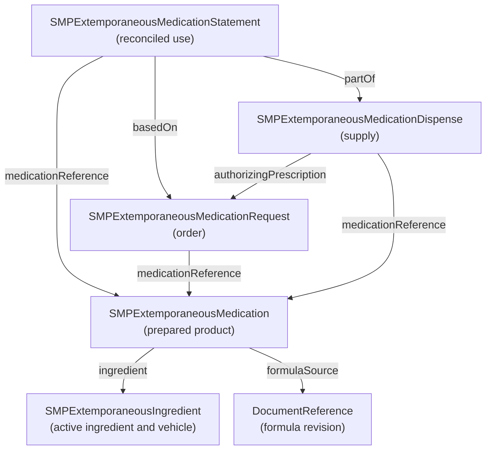

### Extemporaneous preparations

#### Overview

Extemporaneous preparations are medications compounded for an individual patient in response to an identified need. Compounding involves combining or modifying drug ingredients to tailor a medication to that patient's needs. It can address gaps when commercially available products do not provide a suitable dose or dosage form. See [Falconer & Steadman (2017)](https://pmc.ncbi.nlm.nih.gov/articles/PMC5313249/) and the [FDA overview of human drug compounding](https://www.fda.gov/drugs/guidance-compliance-regulatory-information/human-drug-compounding).

Examples of clinical needs that may prompt compounding include:

- Difficulty swallowing solid medications when a suitable liquid is unavailable.
- An individualized dose or concentration that available products cannot provide.
- Administration through a feeding tube when an appropriate formulation is unavailable.

These examples of indications are described by [Falconer & Steadman (2017)](https://pmc.ncbi.nlm.nih.gov/articles/PMC5313249/).

For care transitions, the medication record needs to communicate the prepared formulation, its ingredients and concentration, and the associated order, dispensing event, and reported use. The profiles and examples on this page show how to exchange that information in FHIR.

#### FHIR profiling design

The FHIR R4 design separates the prepared product and its ingredients from the order, dispensing event, and reported medication use. The order, dispense, and statement refer to the same extemporaneous Medication so that receiving systems can retain the formulation details throughout the care transition.

##### Summary of FHIR profiles

| Profile | Parent | Purpose and key information |
| --- | --- | --- |
| [SMPExtemporaneousIngredient](StructureDefinition-smp-extemporaneous-ingredient.html) | `Substance` | Describes an ingredient's identity and optional source container/lot, expiry, and source quantity for traceability. |
| [SMPExtemporaneousMedication](StructureDefinition-smp-extemporaneous-medication.html) | [SMP Medication](StructureDefinition-smp-medication.html) | Describes the prepared product, identifier, code, status, form, ingredients, active flags, concentration, batch, and all three product extensions. |
| [SMPExtemporaneousMedicationRequest](StructureDefinition-smp-extemporaneous-medication-request.html) | [US Core MedicationRequest](https://hl7.org/fhir/us/core/STU8.0.1/StructureDefinition-us-core-medicationrequest.html) | Records preparation reason, product reference, patient, author, date, structured dose, requested quantity, expected supply duration, and intended pharmacy. |
| [SMPExtemporaneousMedicationDispense](StructureDefinition-smp-extemporaneous-medication-dispense.html) | [US Core MedicationDispense](https://hl7.org/fhir/us/core/STU8.0.1/StructureDefinition-us-core-medicationdispense.html) | Records product, patient, performers and roles, location, authorizing order, supplied quantity, preparation/handover times, and structured directions. |
| [SMPExtemporaneousMedicationStatement](StructureDefinition-smp-extemporaneous-medication-statement.html) | [SMP MedicationStatement](StructureDefinition-smp-medicationstatement.html) | Records current use, order and dispense links, product, patient, effective period, assertion time, information source, and structured dose. |

The product requires a code, status, form, and at least one ingredient. Every ingredient requires an identity and an explicit active/inactive flag; invariant `smp-extemp-1` requires at least one active ingredient. Ingredient identity can be a CodeableConcept or a reference to an extemporaneous Substance or SMP Medication. Substance references allow source materials to be described separately from the prepared product.

The order, dispense, and statement constrain `medication[x]` to a reference to the extemporaneous Medication. Ingredient source quantities describe source containers, while `Medication.ingredient.strength` describes the ingredient's strength or concentration in the prepared product. `MedicationDispense.quantity` records the final amount supplied.

##### Preparation-specific extensions

| Extension | Context and value | Purpose |
| --- | --- | --- |
| [SMPExtemporaneousFormulaSource](StructureDefinition-extemporaneous-formula-source.html) | Medication; Reference(DocumentReference) | `formulaSource` references a DocumentReference describing the controlled formula or monograph. |
| [SMPExtemporaneousPreparationInstructions](StructureDefinition-extemporaneous-preparation-instructions.html) | Medication; string | `preparationInstructions` gives supplementary notes and directs users to the controlled formula. |
| [SMPExtemporaneousStorageInstructions](StructureDefinition-extemporaneous-storage-instructions.html) | Medication; string | `storageInstructions` directs the receiving team to the labeled handling instructions. |
| [SMPExtemporaneousPreparationReason](StructureDefinition-extemporaneous-preparation-reason.html) | MedicationRequest; CodeableConcept | `preparationReason` records the clinical reason for compounding. |

Each extension slice is optional, at most once, and Must Support. When present, its value is required exactly once; nested extensions are prohibited.

##### Resource relationships

#### Examples

The following fictional scenario provides the clinical context for the comprehensive standalone examples:

    

Jordan Example, an older adult moving between care settings, cannot swallow solid oral dosage forms. In this fictional case, Avery Clinician orders an extemporaneously prepared omeprazole oral suspension. The order records why preparation is needed, identifies the intended pharmacy, and specifies the formulation and directions so the receiving care team can distinguish the liquid from other medication products.

On August 31, 2026, Avery orders the illustrative 2 mg/mL formulation, with directions to take 5 mL by mouth once daily. The requested 120 mL represents 24 days at that volume. These values are synthetic exchange data, not treatment recommendations.

On September 1, Example Compounding Pharmacy prepares the product using its controlled formula reference, revision 3. The record identifies the active ingredient and inactive vehicle, their source container identifiers, available quantities, and expiration dates. Morgan Pharmacist reviews the product and counsels Jordan. The dispensing record identifies both the pharmacy and pharmacist, the dispensing site, preparation time, handover time, and 120 mL supplied.

The prepared product has lot `CMP-2026-0901` and an illustrative recorded discard date of October 1. Its preparation and storage notes point to the pharmacy-controlled instructions and label. Neither that date nor the example formula link establishes a validated stability period or preparation procedure.

On September 2, Avery reconciles the medication during the care transition, confirming the pharmacy label, concentration, dose volume, batch, and discard date with Jordan and the pharmacy. The resulting medication statement links to the same product, order, and dispensing event. The receiving team can see what was ordered, what was supplied, and what was reported as current use without inferring that dispensing proves administration.

The extemporaneous examples represent one patient's preparation, prescription, dispensing event, and reported medication use. They demonstrate five extemporaneous profiles and four extensions in two forms.

##### Example summary

- **Comprehensive standalone examples:** `input/fsh/EX_SMPExtemporaneous-comprehensive.fsh` defines 12 linked resources, each with `Usage: #example`. The [prepared Medication](Medication-extcomp-compound-med-1.html), [order](MedicationRequest-extcomp-request-1.html), [dispense](MedicationDispense-extcomp-dispense-1.html), and [reconciled medication statement](MedicationStatement-extcomp-statement-1.html) provide entry points into the scenario.
- **Collection Bundle:** `input/fsh/EX_SMPExtemporaneousPrep.fsh` defines the [Extemporaneous Preparation Example](Bundle-extemporaneous-preparation-example.html), containing ten resources declared with `Usage: #inline`. Matching lowercase UUID URNs connect the Bundle entries; the inline resources are not separate published examples.

The Bundle presents a simpler version of the same scenario. It includes the patient, requester, pharmacy, formula reference, two ingredient Substances, Medication, MedicationRequest, MedicationDispense, and MedicationStatement. The comprehensive examples add a pharmacist and location, formula revision metadata, and a reconciliation note. The comprehensive dispense and statement include structured dosage details; their Bundle counterparts include dosage text only. Both orders include structured dosage details.

The prepared Medication uses different coding in the two examples:

| Example | Medication coding | Meaning |
| --- | --- | --- |
| Comprehensive standalone | `http://example.org/compound-catalog#OMEP-2-SUSP` | Illustrative local code for the omeprazole 2 mg/mL oral suspension. |
| Collection Bundle | `http://www.nlm.nih.gov/research/umls/rxnorm#7646` (`omeprazole`) | Ingredient-level RxNorm concept; it does not identify the complete formulation, concentration, or dosage form. |

Both examples retain the formulation description in `Medication.code.text`, the dosage form in `Medication.form.text`, and the concentration in `Medication.ingredient.strength`. Both active-ingredient Substance resources also use RxNorm `7646`. The prescribed 5 mL volume at 2 mg/mL represents a 10 mg dose; concentration, dose volume, and total quantity supplied are distinct values.

The ingredient source quantities (5 g and 500 mL) describe source containers, not amounts consumed in preparation. The 120 mL dispense quantity describes the final product supplied.

The preparation reason in both orders is inability to swallow solid oral dosage forms. Neither example establishes that no equivalent commercial formulation or exact RxNorm product concept exists. The ingredient-level code in the Bundle must be interpreted with the formulation details, rather than as a complete product identifier.

In the comprehensive examples, patient, prescriber, pharmacy, pharmacist, and location resources provide the remaining context. `Reference(...)` links the standalone resources using resource type and ID. In the Bundle, references instead resolve against `entry.fullUrl` UUID URNs; pharmacist and location resources are omitted.

The comprehensive standalone examples populate every element explicitly marked Must Support in the five extemporaneous profiles. The simpler Bundle does not populate all of these optional elements, such as dispensing location and active-ingredient description. Must Support is distinct from minimum cardinality: optional elements do not become mandatory in every instance merely because the comprehensive examples populate them. Inherited profile requirements still apply.

##### Example instances and profiles

The following tables connect the published standalone instances and the inline Bundle resources to the five extemporaneous profiles, then identify the standalone instances demonstrating each extension.

| Profile | Published standalone example instance |
| --- | --- |
| [SMPExtemporaneousIngredient](StructureDefinition-smp-extemporaneous-ingredient.html) | [extcomp-ingredient-api](Substance-extcomp-ingredient-api.html), [extcomp-ingredient-vehicle](Substance-extcomp-ingredient-vehicle.html) |
| [SMPExtemporaneousMedication](StructureDefinition-smp-extemporaneous-medication.html) | [extcomp-compound-med-1](Medication-extcomp-compound-med-1.html) |
| [SMPExtemporaneousMedicationRequest](StructureDefinition-smp-extemporaneous-medication-request.html) | [extcomp-request-1](MedicationRequest-extcomp-request-1.html) |
| [SMPExtemporaneousMedicationDispense](StructureDefinition-smp-extemporaneous-medication-dispense.html) | [extcomp-dispense-1](MedicationDispense-extcomp-dispense-1.html) |
| [SMPExtemporaneousMedicationStatement](StructureDefinition-smp-extemporaneous-medication-statement.html) | [extcomp-statement-1](MedicationStatement-extcomp-statement-1.html) |

The inline resources below are contained in the [Extemporaneous Preparation Example Bundle](Bundle-extemporaneous-preparation-example.html). The identifiers shown are resource IDs within that Bundle; references resolve through the entries' UUID `fullUrl` values.

| Profile | Resource ID within the Collection Bundle |
| --- | --- |
| [SMPExtemporaneousIngredient](StructureDefinition-smp-extemporaneous-ingredient.html) | `ingredient-api`, `ingredient-vehicle` |
| [SMPExtemporaneousMedication](StructureDefinition-smp-extemporaneous-medication.html) | `compound-med-1` |
| [SMPExtemporaneousMedicationRequest](StructureDefinition-smp-extemporaneous-medication-request.html) | `request-1` |
| [SMPExtemporaneousMedicationDispense](StructureDefinition-smp-extemporaneous-medication-dispense.html) | `dispense-1` |
| [SMPExtemporaneousMedicationStatement](StructureDefinition-smp-extemporaneous-medication-statement.html) | `statement-1` |

##### Extension examples

| Extension | Published standalone example instance and element |
| --- | --- |
| [SMPExtemporaneousFormulaSource](StructureDefinition-extemporaneous-formula-source.html) | [extcomp-compound-med-1](Medication-extcomp-compound-med-1.html), `extension[formulaSource]` |
| [SMPExtemporaneousPreparationInstructions](StructureDefinition-extemporaneous-preparation-instructions.html) | [extcomp-compound-med-1](Medication-extcomp-compound-med-1.html), `extension[preparationInstructions]` |
| [SMPExtemporaneousStorageInstructions](StructureDefinition-extemporaneous-storage-instructions.html) | [extcomp-compound-med-1](Medication-extcomp-compound-med-1.html), `extension[storageInstructions]` |
| [SMPExtemporaneousPreparationReason](StructureDefinition-extemporaneous-preparation-reason.html) | [extcomp-request-1](MedicationRequest-extcomp-request-1.html), `extension[preparationReason]` |
